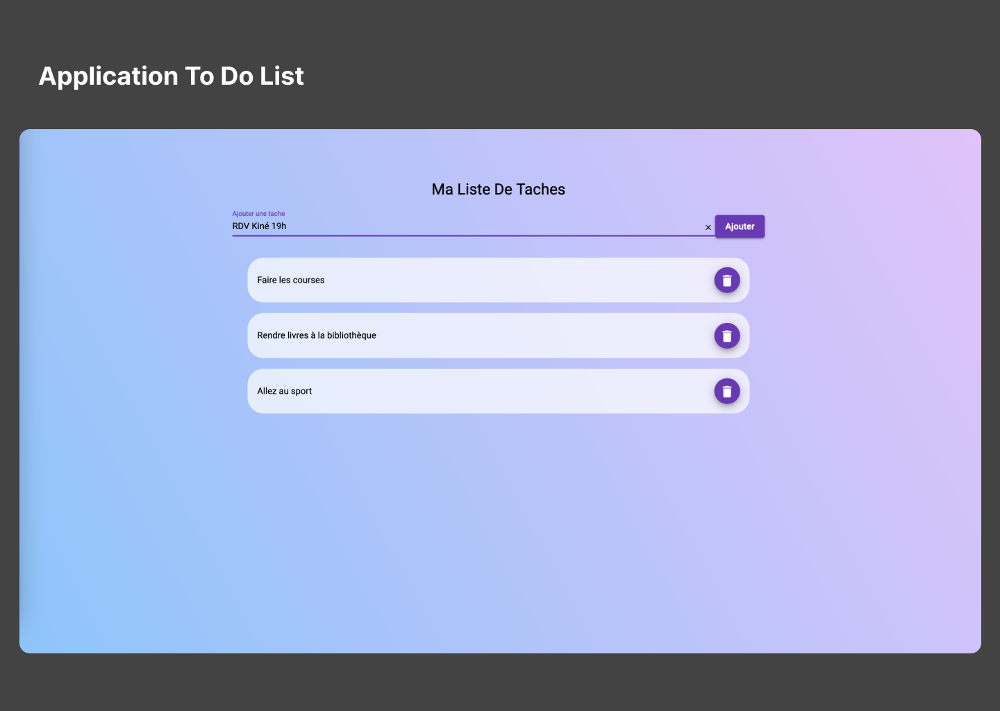

<!-- PROJECT LOGO -->
<br />
<div align="center">
  

  <h3 align="center">Application ToDoList FRONTEND</h3>

  <p align="center">
    Application frontend angular permettant de gerer l'affichage, l'ajout ainsi que la suppression de taches à réaliser.
    L'application frontend a été réalisée avec l'application Angular
    <br />
    <br />
    <br />
  </p>
</div>

<!-- ABOUT THE PROJECT -->
## Preview of The Project




# Getting Started  


### Installation des dépendances & lancement du serveur

``` 
npm install
ng serve

```

Application visible à l'adresse suivante : `http://localhost:4200/`

L'application frontend necessite le lancement du serveur backend ToDoList_Back_Spring disponible sur mon repository.


